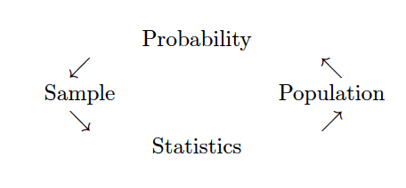

```{r}
#| include: false

# figure options
knitr::opts_chunk$set(
  fig.width = 10, fig.asp = 0.618, out.width = "90%",
  fig.retina = 3, dpi = 300, fig.align = "center"
)
```

```{r}
#| echo: false

# load packages
library(tidyverse)
library(tidymodels)
library(gghighlight)
library(knitr)
options(pillar.width = 70)

# set default theme and larger font size for ggplot2
ggplot2::theme_set(ggplot2::theme_minimal(base_size = 20))
```


## Inference

```{r fig.cap = "Probability vs. Statistics",  out.width="95%", fig.align='center', echo=FALSE}

```

## Generalized Linear Models

$$g(E(Y|x)) = \beta_0 + \beta_1 \cdot X_1 + \beta_2 \cdot X_2 \ldots$$

Linear: $g(\cdot) = \cdot$

Logistic: $g(\cdot) = logit(\cdot)$

Poisson: $g(\cdot) = \ln(\cdot)$

## Interpreting variables

* Categorical
* Interaction
* Linear
* Multicollinearity

## Survival analysis

* Censored observations
* Survival vs. hazard models
* Partial likelihood

## Model Building

<div>
  <center></center>
</div>


## Multiple comparisons

* How many tests (in the wild) are null? how many are true?
* How do we control FWER?
* How do we control FDR?
* How do we control a single type I error over multiple looks at the observations?

## AI

Statisticians are vital to the beginning and the end of the process.

* What questions to ask?
* How were the data generated?
* Can causation be claimed?
* Can you generalize to the population?
* What is the context within which the analysis is taking place?


